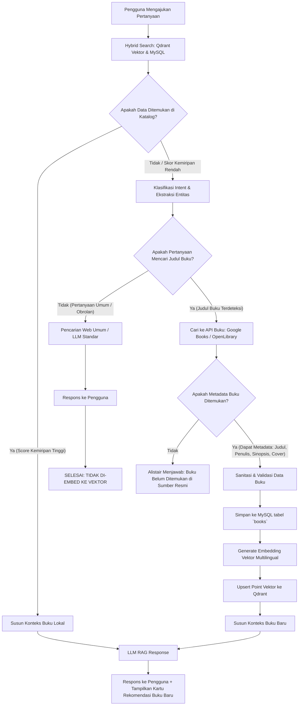

# Rencana Pengembangan Masa Depan: Self-Learning Dynamic RAG & Web Search Fallback
*(Konsep dan arsitektur ini juga dapat diterapkan pada sistem RAG lainnya yang mampu mengumpulkan dan memperluas basis pengetahuan secara mandiri dengan bantuan interaksi pengguna / crowdsourced knowledge base)*

---

## 1. Pendahuluan & Latar Belakang
Pada implementasi Retrieval-Augmented Generation (RAG) konvensional, basis pengetahuan (Knowledge Base) bersifat statis—hanya mencakup data yang sudah di-ingest sebelumnya ke dalam database vektor (seperti Qdrant) dan database relasional (MySQL).

Ketika pengguna menanyakan entitas baru (misalnya: judul buku, komik, atau novel yang belum terdaftar di perpustakaan Alistair), sistem RAG biasa akan mengembalikan respons bahwa buku tersebut tidak ditemukan.

Modul pengembangan masa depan ini merancang sistem **Self-Learning Dynamic RAG**:
1. Mendeteksi jika entitas yang ditanyakan tidak ditemukan di basis data lokal.
2. Melakukan pencarian otomatis ke internet (*fallback web search*) melalui API data terpercaya.
3. **Kondisi Selektif (Entity-Filtered Ingestion)**: Jika data yang ditemukan terbukti merupakan **judul buku valid**, sistem akan menyimpannya ke MySQL dan men-generate embedding untuk dimasukkan ke Qdrant secara otomatis.
4. Jika pertanyaan di luar entitas buku (misal percakapan umum, trivia, sapaan), jawaban tetap diberikan namun **tidak dimasukkan ke koleksi vektor**, menjaga kebersihan basis pengetahuan.

---

## 2. Diagram Alur Sistem (Architecture Workflow)



---

## 3. Komponen Utama Arsitektur

### 3.1. Deteksi Ambilan Kosong (*Retrieval Miss Detection*)
* Menetapkan ambang batas kemiripan (*similarity threshold*), misalnya `score < 0.60`.
* Jika pencarian vektor di Qdrant tidak menghasilkan kecocokan di atas ambang batas, picu proses identifikasi entitas.

### 3.2. Klasifikasi Intent & Ekstraksi Entitas (*Entity Extractor*)
* Menggunakan LLM dengan format output JSON terstruktur (*Structured Output / Function Calling*):
  ```json
  {
    "isBookQuery": true,
    "confidence": 0.95,
    "extractedTitle": "Dune",
    "extractedAuthor": "Frank Herbert",
    "categoryHint": "Novel Sci-Fi"
  }
  ```
* **Kriteria Filter**:
  * `isBookQuery === true`: Lanjutkan ke pipeline ingest buku.
  * `isBookQuery === false`: Alihkan ke alur percakapan umum tanpa penyimpanan vektor.

### 3.3. Adapter Pencarian Internet (*External Knowledge Provider*)
Daripada menggunakan web crawler bebas yang menghasilkan data tidak terstruktur (*noisy*), disarankan menggunakan API data buku berstruktur resmi:
1. **Google Books API** (Rekomendasi Utama):
   * Endpoint: `https://www.googleapis.com/books/v1/volumes?q=intitle:{title}+inauthor:{author}`
   * Output: `title`, `authors`, `description`, `categories`, `imageLinks.thumbnail`, `publishedDate`.
2. **OpenLibrary API** (Alternatif Open Source):
   * Endpoint: `https://openlibrary.org/search.json?title={title}`
3. **Web Search API Khusus** (Tavily / Serper / DuckDuckGo):
   * Digunakan sebagai cadangan jika API buku tidak menemukan hasil untuk web novel / manga independen.

### 3.4. Auto-Ingestion & Embedding Pipeline
Saat metadata buku berhasil divalidasi:
1. **Penyimpanan MySQL**:
   ```sql
   INSERT INTO books (title, author, genre, type, description, cover_url, is_auto_ingested)
   VALUES (?, ?, ?, ?, ?, ?, 1);
   ```
2. **Kalkulasi Vektor**:
   * Memanfaatkan model embedding multilingual yang sudah terintegrasi: `Xenova/paraphrase-multilingual-MiniLM-L12-v2`.
   * Gabungkan string representasi: `Judul: ${title}. Penulis: ${author}. Kategori: ${genre}. Sinopsis: ${description}`.
3. **Upsert ke Qdrant**:
   * Simpan vektor 384 dimensi beserta payload lengkap ke koleksi `alistair_books`.

---

## 4. Keuntungan & Nilai Strategis

1. **Perpustakaan Berkembang Otomatis (*Self-Expanding Knowledge*)**:
   * Koleksi buku akan bertambah secara organik seiring dengan minat dan pertanyaan yang diajukan para pengguna.
2. **Kualitas Data Vektor Terjaga (*Clean Vector Store*)**:
   * Mekanisme filter memastikan hanya data yang memenuhi kualifikasi buku yang masuk ke Qdrant, mencegah pencemaran data dari percakapan santai.
3. **Efisiensi Biaya & Kecepatan**:
   * Buku yang pernah dicari satu pengguna akan tersimpan permanen. Pengguna lain yang menanyakan buku serupa di masa mendatang akan langsung dilayani dari database lokal tanpa memanggil API internet lagi.

---

## 5. Penerapan pada Sistem RAG Lainnya (Generalisasi)
*(Arsitektur ini tidak terbatas pada buku, melainkan dapat diadopsi pada berbagai use-case RAG interaktif lainnya)*

| Domain RAG | Entitas yang Disaring | Sumber Pencarian Eksternal | Hasil Ingest Otomatis |
| :--- | :--- | :--- | :--- |
| **Katalog E-Commerce** | Nama produk, SKU, spesifikasi teknis | Supplier API / Web Merchant | Basis data produk baru |
| **Customer Support / Helpdesk** | Error code software, solusi bug | Dokumentasi resmi / GitHub Issues | Knowledge base solusi teknis |
| **Riset Medis / Akademik** | Judul jurnal, paper ilmiah, DOI | ArXiv API / PubMed / CrossRef | Koleksi literatur riset baru |
| **Kamus / Ensiklopedia Khusus** | Istilah teknis, glosarium baru | Wikipedia API / Kamus daring resmi | Entri leksikon baru |

---

## 6. Pertimbangan Teknis & Mitigasi Risiko

1. **Latensi Respons Pengguna**:
   * *Solusi*: Berikan jawaban ke pengguna secara langsung, sementara proses kalkulasi embedding dan penyimpanan ke Qdrant dijalankan di latar belakang (*background job / message queue*).
2. **Pencegahan Data Duplikat**:
   * *Solusi*: Gunakan normalisasi judul (huruf kecil, hapus karakter khusus) dan verifikasi ISBN / kesamaan teks sebelum melakukan insert ke MySQL.
3. **Kontrol Kualitas Data**:
   * *Solusi*: Tambahkan kolom flag `is_auto_ingested TINYINT(1) DEFAULT 1` dan `is_verified TINYINT(1) DEFAULT 0` pada tabel `books`, sehingga kurator/admin dapat meninjau buku-buku baru yang didaftarkan oleh sistem AI.
4. **Batas Kuota API (*Rate Limiting*)**:
   * *Solusi*: Terapkan sistem cache sederhana (in-memory / Redis) untuk kata kunci pencarian eksternal yang gagal atau sering berulang.

